# Disclaimer
This is still a prototype; the circuit design was built and tested on a perfboard, the KiCad board design was never tested. Use at your own risk and plz **don't come whining if you damage stuff or set your house on fire.**

# WARNING
This project entails working with a 220V powered device with a metal chassis and **no grounding**. These devices are 40+ years old and saw lots of abuse; wire insulation may fail, and motor windings may short circuit. Before wiring anything up, check impedance between the chassis, the engine hull, and all contacts carrying 220V power; anything below 2 megaohms means insulation needs to be re-checked. 
Consider wiring the blind chassis to the ground line for additional safety.

# Metro Blinds Driver

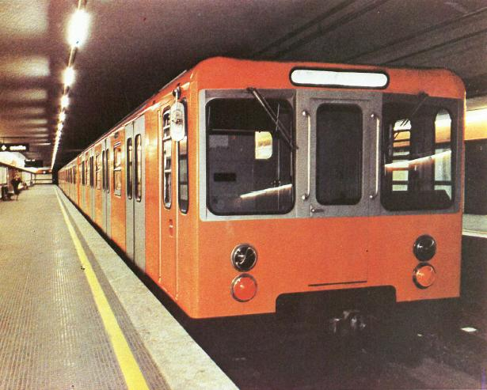

Arduino-based driver board to control Acotral MA100 electric locomotives' front and side stops blinds.

Acotral MA100s were first issued to Rome's **"A"** metro line where they were in service between 1980 and 2005, before being overhauled/modified and reassigned to the Roma Lido line until their decommissioning in 2018. 

[Trasporti di Roma](https://romaatac.altervista.org/mezzi-di-roma/ma-100/)
[Wikipedia](https://it.wikipedia.org/wiki/Elettromotrici_ACOTRAL_MA_100)

Stops signaling blinds coming from wagon dismantling started circulating among flip clock collectors and have become a somewhat common find on online marketplaces.

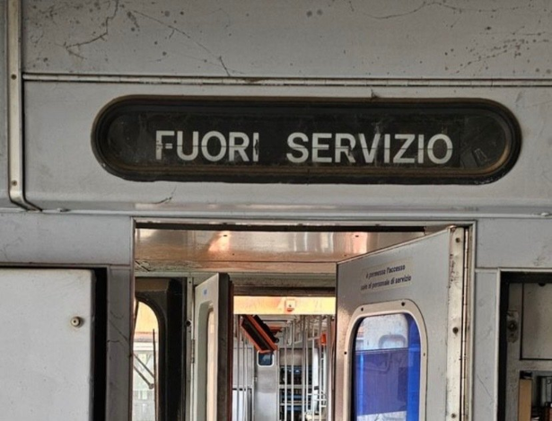

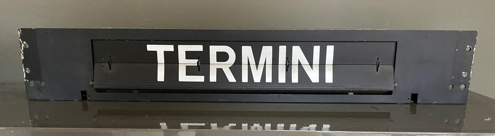

Blinds are controlled through a 7-bit string identifying stops and are powered at 110V AC (motor) / 48V DC (control). This project emulates original locomotive control signals to drive them and display stops.

The board design in this project runs 5V DC control signals and 220V power; it requires minimal modifications to the original blinds' wiring. It is fairly easy, however, to adapt it to run 48V/110V to 100% preserve the integrity of the original wiring.

## Main features   
- Runs through stops using the blind's internal motor
- Allows manual stop selection or programmed stops sequence mode
- Allows saving configurations to the Arduino EEPROM
- Implements several controls to prevent damage/overheating in case of malfunctions

## Manual vs. Program mode

In **manual mode** (default), stops are selected through serial port commands or single button presses. The board LED is lit during Manual mode. 

**Program mode** automatically loops a sequence of stops, one step every hour by default. The program will be resumed from the last reached stop in case of power OFF/ON; the hourly step timer will be reset. The board LED is off during Program mode.

To switch between modes, either use serial commands or press the board button for **3 seconds**. 

## Dependencies

- EEPROM (comes with Arduino IDE)
- [Rocket Scream Low Power](https://github.com/rocketscream/Low-Power)

## Arduino circuit board

Check the schematic in this repo; I've built and tested it on perfboard. The board design might not be 100% correct, and the layout could definitely use some improvement.

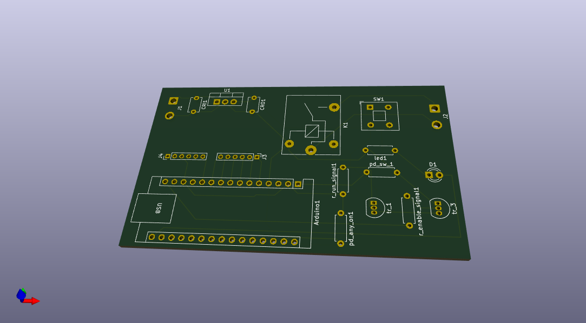

**How to read LED signals**

Either for good or bad news, the Arduino board LED will flash. 

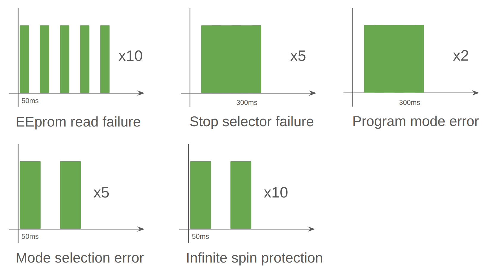

## Original electromechanical control logic 

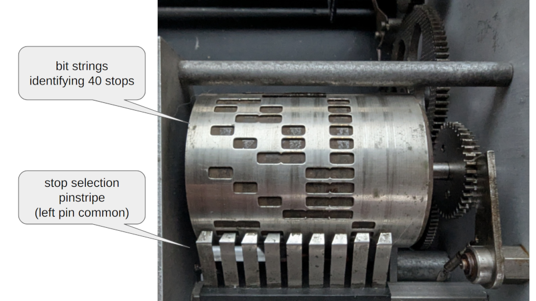

A punched roller is used to encode 40 unique blind positions. When a string of bits is applied to the pinstripe, the motor spins until the holes combination under the pinstripe matches powered pins, i.e.:

- **0b00111000** bit string corresponding to Termini station is applied to the pinstripe, powering pins 4, 5, 6 from the left (1st left pin is common)
- **0b0011110** bit string on the control roller is under the pinstripe; current flows through pins 4, 5, 6, and the motor spins
- Next roller bit string is **0b0100110** on the control roller; current flows through pin 6, and the motor keeps spinning
- The roller bit string is now **0b11000111**; all 1s on the pinstripe match a 0 on the roller, no current flows, the motor **stops** and will remain still until a different bit string is selected.

The original control board has 7 control pins, 2 relay coil pins, and 2 motor power pins, exposed through a DIN 41622 male connector on the side or back panel.

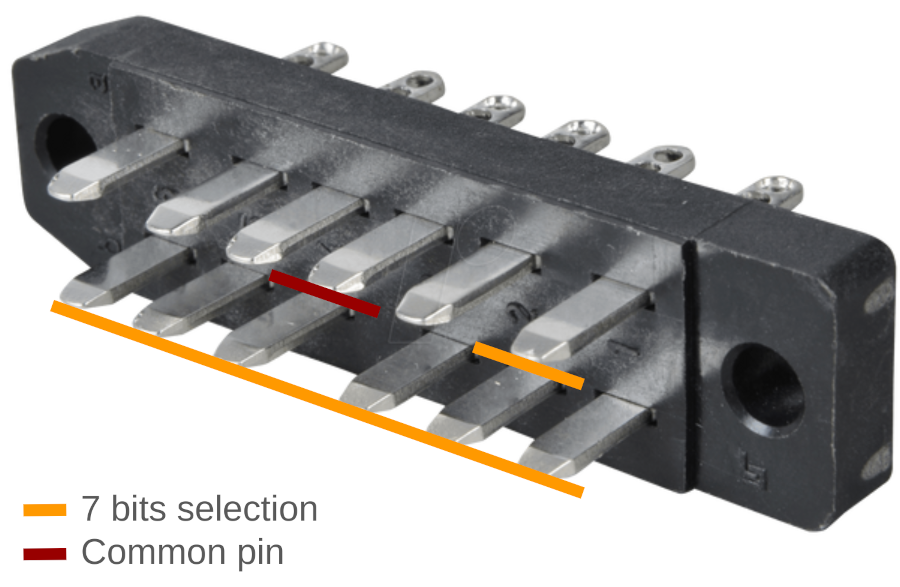

The original wiring:
- Pin 1-6 and 12: stop selection bit string
- Pin 11: unwired
- Pin 10: 110V AC to relay interrupted line
- Pin 9: Relay coil (+48V signal from selection roller return line)
- Pin 8: Relay coil N
- Pin 7: 110V returning from motor

## Blind Board schematic and modifications

The blind board schematic is available in "metroBlindDriver blind board" KiCad design:

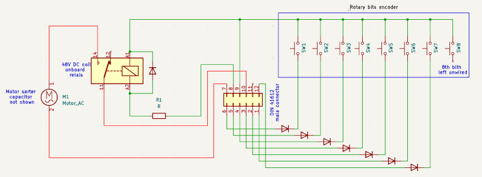

In the original blind design, 48V DC bits would be fed into pins 1-6 and 12; they would reach the control roller through diodes and would power the 48V relay coil through the roller common pin until the desired stop was reached. 

The original blind wiring can be easily modified to accept standard household 220V AC power and 5V DC signals.

**IMPORTANT**: Don't use this board design with 48V signals to avoid damage and fire hazard!

**IMPORTANT**: Don't run 220V AC through the motor before its coils are wired in series to avoid damage and fire hazard!

**220V AC motor wiring** Wire the motor as shown in the picture below to drive it with 220V AC power. Plastic motor caps on most (all?) blinds have diagrams explaining how to wire coils in series/parallel.
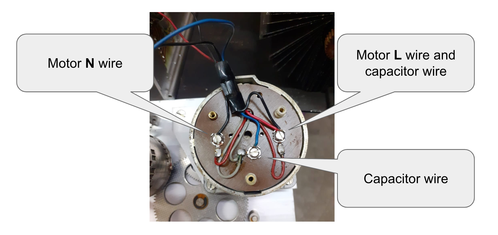

**5V DC external relay wiring**

To bypass the 48V coil and use an external relay, clip the motor **N** wire from the connector board trace (board end, not motor end!) and solder it to the top left pin on the DIN connector. If in doubt, use the only pin trace with no wires attached. 

Replacing the original 48V relay with a 5V or 12V one isn't sufficient, as the coil has a 4kohm resistor wired in series; plus, compatible relays are out of production, hard to source, and quite expensive. 

I wanted to preserve the original circuitry as much as possible, but definitely didn't want to faff with 48V signals.
I figured since I had already wired the motor for 220V AC, another small modification wouldn't matter much, and moving a wire to a different pin seemed way less invasive than replacing a relay and a big *ss resistor.
You might want to do things differently here; the circuit is easy enough to work with, these are just my 2c :-) 

Rewired schematic below:

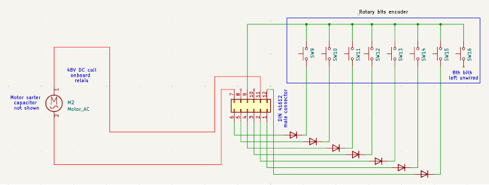

The new wiring:
- Pin 1-6 and 12: 5V bit string
- Pin 11: to motor relay NO contact on Arduino board
- Pin 10: unwired, can be used to ground the blind chassis
- Pin 9: to Arduino "Any Running" pin
- Pin 8: unwired
- Pin 7: to motor relay NO contact on Arduino board

## How to install and adjust

**First things first, let's not fry stuff**

- Check wirings and voltages
- **Mandatory**: rewire the blind board to use an external 5V relay; **don't use 48V signals with this Arduino board design!**
- **Optional**: rewire the motor to run on 220V AC; if you happen to have a 110V AC power source, that will work fine
- Wire the DIN connector pins; be sure not to short circuit anything
- Power the board and the motor **L** wire
 **No smoke? Good.**

By default, the controller will wait for commands in manual mode with the board LED **ON**.

- Press the board button briefly; the blind should roll one stop forward
- (Optional) press the board button for 3 seconds to switch to Program mode

## Push buttons commands

- **Brief press:** move one stop forward
- **3 seconds press:** switch between Manual and Program mode

## Serial port commands

Commands format: **(<<|>>)[A-Z,0-9]+**

- **<<** to read info, **>>** to set
- Command name, in caps
- (Where applicable) parameters

One command per line; the parser is pretty crude, please stick to tested commands ;-) 

**Available commands**:

- **>>GO[0-9][0-9]** select stop by zero-padded two-digit number, 01-40 (only works in manual mode)
- **>>(stop name)** (i.e., >>ANAGNINA, >>CINECITTA) select stop by name (only works in manual mode)
- **>>STOP** halt the motor
- **>>RUN** continuously run the motor 
- **>>PROGRAMSTEPSSECONDS[0-9]{4}** write steps duration for program mode, zero-padded four digits
- **<<PROGRAMSTEPSSECONDS** read steps duration for program mode
- **>>DEFAULTPROGRAM** load the default stops program to memory
- **>>PROGRAMSTOPS[0-9][0-9](?:[0-9][0-9]){0,39}** write program mode stops sequence, zero terminated, up to 40 zero-padded two-digit positive integers. The sequence is required to be ascending (i.e., 1-2-3 valid, 1-3-2 not valid)
- **<<PROGRAMSTOPS** print the program stops sequence currently in memory
- **>>PROGRAMMODE** switch to Program mode
- **>>MANUALMODE** switch to Manual mode (default)
- **>>RESETDEFAULTS** reset default configuration 
- **>>EEPROMDATA** read current conf from eeprom 
- **<<EEPROMDATA** write current conf to eeprom
- **<<POSITION** print the current blind roller position
- **<<COMPILEDATETIME** print the sketch build timestamp

## Build flags

-DEBUG_MODE enable serial port debug messages, disable sleep mode

## Unreachable stops

The control roller pinstripe 8 signals encode 40 unique bit strings, each with three raised bits (i.e., 0b11001000, 0b00110010). This allows moving from any stop to any other by applying the destination code bit string to stop selection pins. 

At least, this is how the control roller would work hadn't its original designers decided to leave the rightmost pin unwired.

As a result, 5 out of 40 stops are encoded by only 2 wired pins and only work when selected starting from the 13 stops right behind them. 
The matrix below highlights misencoded stops and the stops that would be wrongly displayed when their code is used, i.e.:

- The blind displays stop **2** (code **0b1000110**)
- Stop **21** (code **0b1100000**) is selected
- The blind spins until stop **6**, (code **0b1100001**)
- The bitwise "(input bit string) **AND NOT** (roller bit string)" of stops **21** and **6** codes is 0 -> the relay coil is not powered
- The blind stopped on stop **6** before reaching **21** and would halt on 26, 27, 30 and 37 due to the same reason
- (**Note:** code **0b1100000** correctly drives the blind to stop **21** starting from stops 7-20)

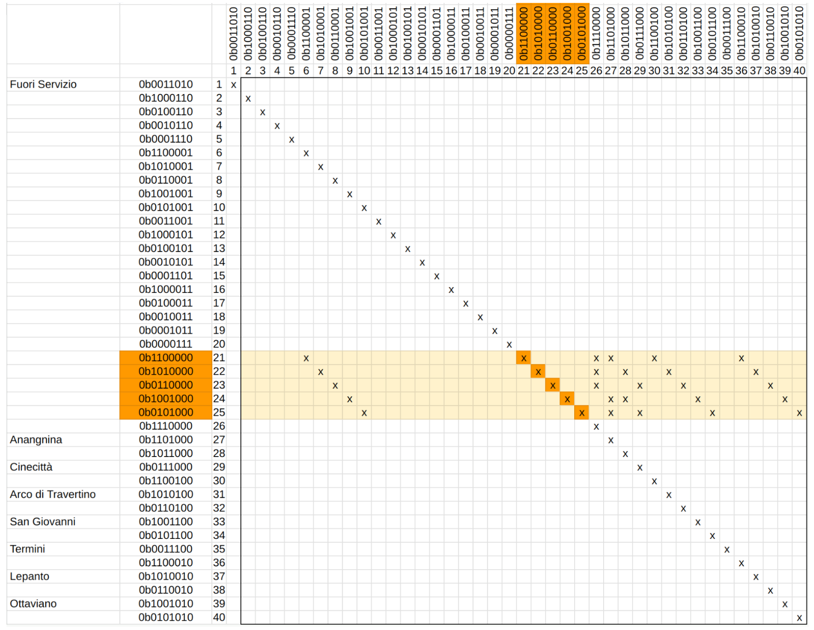

This behavior **did not** affect actual service on Roma Metro **A** as the 5 impacted stops were blank. I decided to leave it unchanged as an interesting quirk of the original design; you might want to fix it if you plan to display anything on stops 21-25 :-D 

## Troubleshooting

**Q:** I can't tell what's going on with EEPROM data.

**A:** The <<EEPROMDATA command can extract all the info saved on the EEPROM.

**Q:** I keep getting "nonexistent stop" error.

**A:** Check wiring; any short circuit? Any missing wire? 

**Q:** Motor buzzes and doesn't spin! What's wrong?

**A:** Have you rewired the motor correctly? 

**Q:** I rebooted the board, and all my configurations are lost.

**A:** Run >>EEPROMDATA to persist configuration on EEPROM.

**Q:** That PCB design is **lame**!

**A:** It is. Any help much appreciated! ;-)

## Todo
- Readme completion
- Circuit board layout improvement