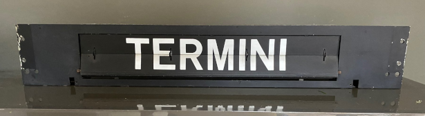
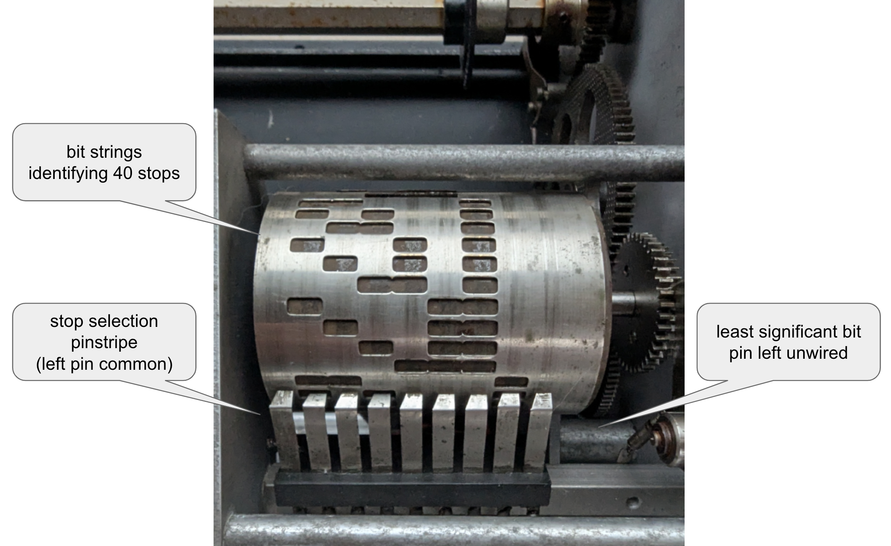
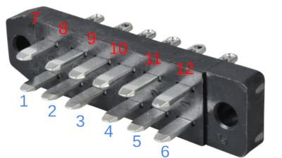

# Disclaimer
This is still a prototype, the circuit design was built and tested on a perfboard, the kicad board design was never tested.  use at your risk and plz **don't  come whining if you damage your flip clock or set your house on fire.**

# Metro Blinds Driver

Arduino based driver board to drive Acotral MA100 electric locootives front and side stops blinds.

Acotral MA100s were first issued to Rome's **"A"** metro line were they were in service between 1980 and 2005, before being overhauled/modified and reassigned to Roma Lido 
line until their decommissioning in 2018. 

[Trasporti di Roma](https://romaatac.altervista.org/mezzi-di-roma/ma-100/)
[Wikipedia] (https://it.wikipedia.org/wiki/Elettromotrici_ACOTRAL_MA_100)

Stops signaling blinds coming from wagons dismantling started circuilating among flip clocks collectors and have become a somewhat commong find on online markets

Blinds are controlled through 7 bits string identifying stops and are powered at 110V AC (motor)/ 48V DC (control), this board emulates original locomotive control signals to control them and display stops.

This board runs 5V DC control signals and 220V power, it requires minimal modifications to the original blinds wiring, it is fairly easy anyhow to adapt it to run 48V/110V to 100% preserve the integrity of original wiring.

**Main features:**   
- Runs through stops using the blidn's internal motor
- Allows manual stop selection or programmed sequence mode
- Allows to save configurations to the Arduino EEprom
- Implements several controls prevent damage/overheating in case of malfunctions

## Original electro mechanical control logic 

A punched roller is used to encode 40 unique blind position, when a string of bits is applied to the pinstripe the motor spins until the holes combination under the pinstripe matches powered pins, i.e.:

- **0b00111000** bit string corresponding to Termini station is appled to the pinstripe, powering pins 4,5,6  from the left  (1st left pin is common)
- **0b0011110** bit string on the control roller is under the pinstripe, current flows through pins 4,5,6, the motor spins
- Next roller bit string is **0b0100110**  string on the control roller is under the pinstripe, current flows through pins 6, the motor keeps spinning
- The roller bit string is now **0b11000111**, all 1s on the pinstripe match a 0 on the roller, no currnt flows, the motor **stops** and wil remain stil until a different bit string is selected.

The original control board has 7 control pins, 2 relais coil pins and 2 motor power pins, exposed through a DIN 41622 male connector on the side or back or back panel

the control roller common pin is not wired to the relais coil, their pins are to be jumpered to run the blind control at 48V using its original relais.

## 220/5V modification

The original blind wiring can be easily modificed to accept standard household 220V AC power and 5V DC signals, 

**IMPORTANT**: don't use this board design with 48V signals to avoid damage and fire hazard!

**IMPORTANT**: don't run 220V AC through the motor before its coils are wired in series to avoid damage and fire hazard!

**220V AC motor wiring** 

Wire the motor as shown in the picture below to drive it with 220V AC power, the plastic motor cap on most (all?) blinds have diagrams explaining how to wire motor coils in series/parallel

**5V DC external relais wiring**

To bypass the 48V  coil and use an external relays, clip the motor **N** wire and solder it to the top left pin on the DIN connector, if in doubt, use the only pin trace with no wires attached. 

Replacing the original 48V relais with a 5V or 12V one isn't sufficient, as the could has a 4kohm resistor wired in series, plus, compatible relais are out of production, hard to source and quite expensive. 

I wanted to preserve the original circuitry as much as possible, but definitely didn't want to faff with 48V signals; I figures since I had already wired the motor for 220V AC another small modification wouldn't matter much, and moving a wire to a diffeent pin seemed way less invasive than replacing a relais and a big *ass resitor.
You might want to do things differently here, the circuit is easy enough to work with, these are just my2c :-) 

**AC power traces picture coming**

## Dependencies

- [Regexp](https://github.com/nickgammon/Regexp)
- [Rocket Scream Low Power](https://github.com/rocketscream/Low-Power)

## Circuit Board

**WORK IN PROGRESS** check the schematic in this repo, I've built and tested it on perfboard, board design might not be 100% correct, and definitely the layout could 
use some improvement.

**How to read led signals**

Either for good or bad news, green led will flash. red will stay on when general enable switch is on

(WIP)

## How to install and adjust

**First things first, let's not fry stuff**

- Check your blind motor wiring, the motor requires rewiring to run at 220V
- Solder the motor N wire to pin #XX
- Wire output pins 1 to 7

(WIP)

- Power the board.
 **No smoke? good.**

By Default the controller will cycle through its default stops sequence

## Enabling motor movement

(WIP)

## Push buttons commands

(WIP)

## Serial port commands

Commands format: **(<<|>>)[A-Z]{1,10}[a-z,A-Z,0-9]{1,20}**

- **<<** to read info, **>>** to set
- command name, in caps
- (where applicable) parameter

One command per line, max 32 chars long. the parser is pretty crude, pls stick to tested commands ;-) 

**Available commands**:

- **<<BOOTTIMESTAMP** prints the curent boot timestamp

- **<<COMPILEDATETIME** print the sketch build timestamp
(WIP)

## Build flags

-DEBUG_MODE enable serial port and LCD debug messages, disbales sleep time  and force reinitialization of eeprom and rtc module on each read

## Troubleshooting

**Q:** I can't tell what's going on with eeprom data

**A:** <<EEPROMDATA command can extracts all the info saved on the eeprom

**Q:** That PCB design is **lame**!

**A:** It is. any help much appreciated! ;-)

## Todo
- tons of stuff still to be done

# Disclaimer
This is still a prototype, the circuit design was built and tested on a perfboard, the kicad board design was never tested.  use at your risk and plz **don't  come whining if you damage your flip clock or set your house on fire.**

# Metro Blinds Driver

Arduino based driver board for Rome Metropolitana A front and side blinds

**Main features:**   
- (WIP)

## Dependencies

- [Regexp](https://github.com/nickgammon/Regexp)
- [Rocket Scream Low Power](https://github.com/rocketscream/Low-Power)

## Circuit Board

**WORK IN PROGRESS** check the schematic in this repo, I've built and tested it on perfboard, board design might not be 100% correct, and definitely the layout could 
use some improvement.

**How to read led signals**

Either for good or bad news, green led will flash. red will stay on when general enable switch is on

(WIP)

## How to install and adjust

**First things first, let's not fry stuff**

- Check your blind motor wiring, the motor requires rewiring to run at 220V
- Solder the motor N wire to pin #XX
- Wire output pins 1 to 7

(WIP)

- Power the board.
 **No smoke? good.**

By Default the controller will cycle through its default stops sequence

## Enabling motor movement

(WIP)

## Push buttons commands

(WIP)

## Serial port commands

Commands format: **(<<|>>)[A-Z]{1,10}[a-z,A-Z,0-9]{1,20}**

- **<<** to read info, **>>** to set
- command name, in caps
- (where applicable) parameter

One command per line, max 32 chars long. the parser is pretty crude, pls stick to tested commands ;-) 

**Available commands**:

- **<<BOOTTIMESTAMP** prints the curent boot timestamp

- **<<COMPILEDATETIME** print the sketch build timestamp
(WIP)

## Build flags

-DEBUG_MODE enable serial port and LCD debug messages, disbales sleep time  and force reinitialization of eeprom and rtc module on each read

## Troubleshooting

**Q:** I can't tell what's going on with eeprom data

**A:** <<EEPROMDATA command can extracts all the info saved on the eeprom

**Q:** That PCB design is **lame**!

**A:** It is. any help much appreciated! ;-)

## Todo
- tons of stuff still to be done

## Dependencies

- [Regexp](https://github.com/nickgammon/Regexp)
- [Rocket Scream Low Power](https://github.com/rocketscream/Low-Power)

## Circuit Board

**WORK IN PROGRESS** check the schematic in this repo, I've built and tested it on perfboard, board design might not be 100% correct, and definitely the layout could 
use some improvement.

**How to read led signals**

Either for good or bad news, green led will flash. red will stay on when general enable switch is on

(WIP)

## How to install and adjust

**First things first, let's not fry stuff**

- Check your blind motor wiring, the motor requires rewiring to run at 220V
- Solder the motor N wire to pin #XX
- Wire output pins 1 to 7

(WIP)

- Power the board.
 **No smoke? good.**

By Default the controller will cycle through its default stops sequence

## Enabling motor movement

(WIP)

## Push buttons commands

(WIP)

## Serial port commands

Commands format: **(<<|>>)[A-Z]{1,10}[a-z,A-Z,0-9]{1,20}**

- **<<** to read info, **>>** to set
- command name, in caps
- (where applicable) parameter

One command per line, max 32 chars long. the parser is pretty crude, pls stick to tested commands ;-) 

**Available commands**:

- **<<BOOTTIMESTAMP** prints the curent boot timestamp

- **<<COMPILEDATETIME** print the sketch build timestamp
(WIP)

## Build flags

-DEBUG_MODE enable serial port and LCD debug messages, disbales sleep time  and force reinitialization of eeprom and rtc module on each read

## Troubleshooting

**Q:** I can't tell what's going on with eeprom data

**A:** <<EEPROMDATA command can extracts all the info saved on the eeprom

**Q:** That PCB design is **lame**!

**A:** It is. any help much appreciated! ;-)

## Todo
- tons of stuff still to be done

